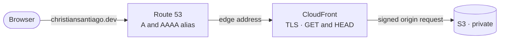
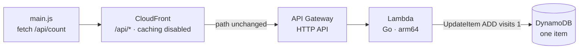
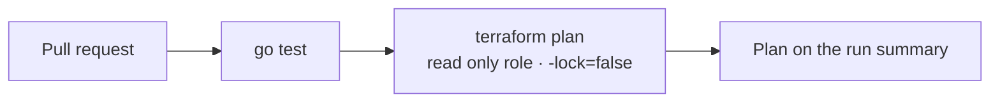
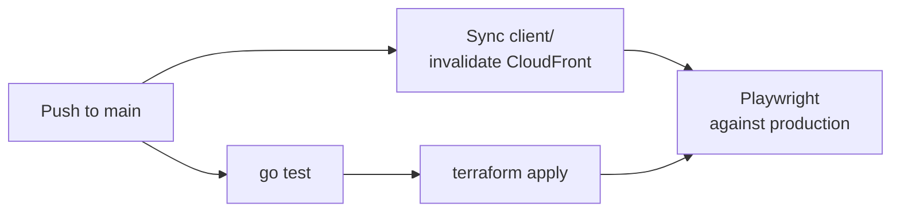

# christiansantiago.dev: A Private S3 Origin Behind CloudFront, a Go Lambda Visitor Counter, and Keyless Deploys

[](https://github.com/Go-Santiago-Go/christiansantiago.dev/actions/workflows/deploy-site.yml)
[](https://github.com/Go-Santiago-Go/christiansantiago.dev/actions/workflows/infra.yml)
[](LICENSE)

Live at **[christiansantiago.dev](https://christiansantiago.dev)**. A [Cloud Resume
Challenge](https://cloudresumechallenge.dev/) build: a single page site on AWS, using:

- **A private S3 bucket** reached only through CloudFront's **Origin Access Control**, with the
  bucket policy pinned to one distribution
- **A visitor counter** that is one atomic DynamoDB `ADD`, not a read followed by a write
- **Go on `provided.al2023`/arm64** behind an HTTP API, with the DynamoDB client behind an interface
  so the handler tests with no AWS calls
- **Same origin routing** through a CloudFront `/api/*` behaviour, so CORS is designed out rather
  than configured
- **Terraform for every resource**, one state, with the ACM certificate in `us-east-1` behind an
  explicit provider alias
- **Three CI roles over OIDC** and no long lived AWS keys anywhere: plan on pull requests, apply and
  publish on `main`
- **A Playwright smoke test against production** that gates the deploy, plus CloudWatch alarms to
  SNS and an account wide budget

The counter is the smallest feature that touches all of it:

> A visitor loads a page that no one can fetch from its origin → the page asks its own domain for a
> number → one write returns the count it just produced → and the only way any of it reached
> production was a push to `main`.

## Contents

| | |
|---|---|
| [Demo](#demo) | The live site, and where the number in the footer comes from |
| [The problem](#the-problem) | What the Cloud Resume Challenge is actually testing, and what each requirement costs if you get it wrong |
| [How it works](#how-it-works) | The two request paths, the four decisions that carry the design, and the pipeline that deploys them |
| [Quickstart](#quickstart) | Clone to a page in a browser, and what deliberately does not run locally |
| [Trade-offs](#trade-offs) | Every design decision, what it was chosen over, and why |
| [Results](#results) | Measured cold start, warm latency, the concurrency test, and what a request costs |
| [What I'd do differently](#what-id-do-differently) | Four things a second pass would change |
| [Known gaps and next steps](#known-gaps-and-next-steps) | Deliberately out of scope, named rather than hidden |
| [Repo layout](#repo-layout) · [Documentation](#documentation) | Where each piece lives, and the five deep-dive docs |

## Demo


Captured from the live site, so 805 is that capture's own count: loading the page to take the
screenshot is what produced it. The hero and the footer are two shots of one page load, stacked,
because everything between them is résumé content rather than anything this repository does.

The number is the only dynamic thing on the page. The markup ships with an em dash there and
JavaScript replaces it, which is why the end to end test asserts on that element rather than on the
API: a `curl` against `/api/count` can succeed while the page still shows the em dash.

## The problem

The Cloud Resume Challenge looks like it is about a résumé, and is actually about the operational
habits around one. A static page is trivial. Serving it from a private origin, deploying it without
storing a credential, counting concurrent visitors without losing writes, and knowing what all of it
costs are not.

What that build has to get right, and what each requirement costs if you get it wrong:

- **The origin is private, or the CDN is optional.** A public bucket means anyone who learns its
  name bypasses CloudFront entirely: no HTTPS enforcement, no caching, no access logging, and an
  origin reachable directly.
- **CI holds no long lived keys.** A leaked access key in a public repository is not an incident, it
  is somebody else's account. OIDC issues a credential per run that expires in about an hour.
- **A counter that is read then write loses counts silently.** Two requests read the same value
  before either writes; nothing errors and the number still goes up, so the bug ships.
- **Cross origin is a configuration you have to keep correct.** Every domain change means a CORS
  allowlist to remember. Routing the API through the site's own domain removes the class of mistake
  instead of managing it.
- **Idle cost is the failure mode, not peak cost.** Nothing here may bill while nobody is visiting,
  which rules out provisioned throughput, NAT gateways, and always on compute before any of them
  gets designed in.
- **A green unit test is not a working site.** The count only exists after JavaScript runs, so the
  only check that can see a dead counter is one driving a real browser at production.

## How it works

A page load never reaches compute. CloudFront serves it, and on a miss fetches from a bucket nobody
else can read:



The counter path starts in the page that load returned, and never leaves the origin:



Four ideas carry the design, each covered in depth in [docs/ARCHITECTURE.md](docs/ARCHITECTURE.md):

**The bucket is private, and two halves make that work.** Origin Access Control makes CloudFront sign
its origin requests, which only identifies the caller. The bucket policy authorises that caller, and
its `AWS:SourceArn` condition pins the grant to this one distribution. Without the condition, the
policy reads "any distribution in any AWS account may read this bucket". The policy grants
`GetObject` and not `ListBucket`, so nobody can enumerate the bucket through the CDN, and the visible
cost is that a mistyped URL returns 403 rather than 404.

**The count comes back from the write.** A single `UpdateItem` carrying `ADD visits :one` with
`ReturnValues: UPDATED_NEW` sends an instruction rather than a value, and DynamoDB evaluates it under
a lock, so concurrent callers queue instead of interleaving. It also means the handler never reads:
the IAM policy grants `UpdateItem` and deliberately not `GetItem`.

**The API is same origin, so CORS never enters the picture.** A CloudFront behaviour on `/api/*`
forwards to API Gateway with the path unchanged. Two managed policies make that work:
`Managed-CachingDisabled`, because a cached counter serves one frozen number to everyone while
DynamoDB increments correctly behind it, and `Managed-AllViewerExceptHostHeader`, because
`execute-api` routes on `Host` and rejects the site's domain as unknown. The honest cost is a hop,
measured at about 80 ms at p50 from one location.

**The DynamoDB client sits behind an interface declared where it is consumed.** Go satisfies
interfaces structurally, so `*dynamodb.Client` satisfies a one method `Updater` without knowing it
exists, and the tests supply a fake with no AWS calls and no network. A compile time assertion fails
the build if the SDK ever stops satisfying it.

| Path | Origin | Purpose |
|---|---|---|
| `GET /` | S3, private | The single page. `index.html` is supplied by CloudFront, since a private bucket has no website endpoint. |
| `GET /api/count` | API Gateway → Lambda → DynamoDB | Increments and returns the visit count. Never cached at the edge. |
| `GET /resume.pdf` | S3, private | Uploaded outside the sync so `Content-Type: application/pdf` is stated rather than guessed. |

Deployed, `git push` is the only way any of that changes:





Three CI roles rather than one, because they answer to different trust. Deploy and apply are pinned
to `main`. Plan answers to pull requests, which are unreviewed code, so it holds `ReadOnlyAccess` and
runs with `-lock=false`. Sharing one role across both would hand every pull request the reach to
rewrite DNS. The whole trust model, the first apply, and teardown are in
[docs/DEPLOYMENT.md](docs/DEPLOYMENT.md).

## Quickstart

Local first, though "local" is smaller here than in the sibling repositories: there is no build step
and no server to start.

```bash
git clone https://github.com/Go-Santiago-Go/christiansantiago.dev.git
cd christiansantiago.dev

make test                              # go test -race -cover ./... in counter/
python3 -m http.server -d client 8000  # the site, at http://localhost:8000
```

The counter will not resolve locally, and seeing that once is useful. `/api/count` exists only
through CloudFront, so the fetch fails, the console logs it, and the footer keeps its em dash. That
is the designed failure state: the page is complete without the number, and the Playwright suite is
what notices the number never arrived.

```bash
make e2e   # Playwright, against the deployed site
```

`make plan`, `make apply`, and `make destroy` drive Terraform, and each builds the Lambda binary
first, because Terraform packages it and cannot compile it. Full local reference, including the
Chromium install and the resume build, is in [docs/LOCAL_DEV.md](docs/LOCAL_DEV.md). To stand this up
in your own account, see [docs/DEPLOYMENT.md](docs/DEPLOYMENT.md).

## Trade-offs

I optimised every choice below for one constraint: the simplest component that satisfies the
requirement, reaching for managed or heavyweight infrastructure only where the workload genuinely
demands it. On a site that must idle at near zero cost, that constraint does most of the deciding.

| Decision | Choice | Why | Also considered |
|---|---|---|---|
| Origin exposure | Private bucket, CloudFront with OAC | A public bucket makes the CDN optional: anyone with the bucket name bypasses HTTPS, caching, and logging | Public bucket with website hosting, Origin Access Identity |
| Bucket policy scope | `GetObject` only, pinned by `AWS:SourceArn` | Without the condition any distribution in any account can read the bucket; without the narrow action anyone can enumerate it | `GetObject` plus `ListBucket`, no source condition |
| Front end | Plain HTML, CSS, vanilla JS | Nothing to build means nothing to break between commit and bucket, and the deploy stays a byte for byte sync | React, Astro, any static site generator |
| Counter write | One `UpdateItem` with atomic `ADD` | Concurrent callers queue on the item instead of interleaving, and the new count returns with the acknowledgement | Read then conditional write, transactional write |
| Counter store | DynamoDB, on demand | The workload is one keyed atomic increment, which is the operation the service is built around, and it bills nothing at idle | Postgres, Redis, an S3 object |
| Partitioning | One item, one partition | Roughly 1,000 writes per second is orders of magnitude above real traffic, and sharding costs a fan out read forever | Write sharding across `site#0` to `site#9` |
| Lambda language | Go on `provided.al2023`, arm64 | Measured, the runtime is 6.7% of the cold path, and a static binary keeps the deployment package at 4.5 MB | Python with boto3, Node |
| DynamoDB access | Behind a one method interface | The handler and the write both test against a fake with no AWS calls and no network | Take `*dynamodb.Client` directly |
| API product | HTTP API | $1.00 against $3.50 per million, and none of REST's usage plans, API keys, or request validators are used | REST API, a Lambda function URL |
| Browser to API | Same origin via a `/api/*` behaviour | No preflight, no allowlist to keep in step with the domain, and no second certificate | Second origin with a CORS allowlist |
| Cache on `/api/*` | Disabled | Under the site's cache policy the edge serves one frozen number while the table increments correctly behind it | Short TTL, cache by query string |
| Handler failures | Returned as responses, never as Go errors | A non nil error surrenders the status code and body to API Gateway, which answers 502 with nothing in it | Return the error and let the platform answer |
| Error detail | Logged, not returned | DynamoDB errors carry table names and this endpoint is public | Return the wrapped error |
| Lambda log group | Declared in Terraform, 14 day retention | Left implicit it is created outside state with no expiry, so it bills forever and survives a destroy | The managed `AWSLambdaBasicExecutionRole` |
| Rate control | Stage throttle at 20 rps | The endpoint writes to DynamoDB on every hit, so the ceiling is on the bill rather than on abuse | WAF, per IP limiting, no limit |
| IaC | Terraform, remote state with `use_lockfile` | One tool covers CloudFront, Route 53, IAM, and the counter, and native locking removes the DynamoDB lock table | AWS SAM, CDK, S3 plus a lock table |
| Certificate region | `us-east-1` behind a provider alias | CloudFront reads certificates from one region only, and the error when it cannot does not mention regions | Run everything in `us-east-1` |
| Hosted zone | Data source, never a resource | Declaring it creates a second zone with different nameservers, Terraform reports success, and the site resolves to nothing | Declare it, `terraform import` it |
| OIDC provider | Data source, owned by a sibling repo | One provider per issuer per account, so owning it here would let this repo's destroy break the siblings' pipelines | Declare it here |
| CI credentials | OIDC, three roles | A stored access key in a public repo is an account takeover; three roles keep pull request trust separate from `main` | Access keys in secrets, one shared role |
| Plan role reach | `ReadOnlyAccess` with `-lock=false` | A plan takes a state lock by default, which needs write access to buy nothing, since no plan can corrupt state | Give the plan role write access to the lock object |
| Apply role reach | Eleven services, IAM confined to a name prefix | Honest about being least service rather than least privilege; the real control is a trust policy admitting one ref | `PowerUserAccess`, admin |
| Resume upload | Separate `aws s3 cp` with an explicit type | `sync` applies one `Content-Type` to everything it touches, and a wrong guess turns "View Resume" into a download | Let the sync guess, set metadata after the fact |
| Deploy verification | Playwright against production | The count exists only after JavaScript runs, so nothing else in the repo can see a dead counter | `curl` the API in CI, no verification |
| Alarm missing data | Treated as not breaching | A quiet five minutes produces no datapoint, and the default holds the previous state, leaving an alarm reporting last night | Accept the default, publish a synthetic zero |
| Budget scope | Account wide, unfiltered, $5 | A budget's job is catching what you did not anticipate, which a service filter removes | Scope it to this project's services |

The pattern under all of it is **let the platform enforce the property instead of remembering it**:
the bucket cannot be read except by one distribution, the counter cannot lose a write, the pull
request role cannot mutate anything, and a failed smoke test cannot become a successful deploy. Each
of those is a configuration that closes a class of mistake rather than a rule someone has to follow.

Plain HTML, CSS, and JavaScript on the front end, Go with `aws-sdk-go-v2` for the counter, DynamoDB
for state, Terraform for every AWS resource, GitHub Actions over OIDC for delivery, and Playwright
for the one test that runs against production.

## Results

| | Measured |
|---|---|
| Concurrent visits recorded, atomic `ADD` | **500 of 500** at 500 concurrent callers |
| Concurrent visits recorded, read then write | **2 of 500**, and clean under `-race` |
| Cold start, Go runtime init | **91 ms**, against a 1,364 ms first invocation |
| Warm invocation | **p50 5 ms**, p95 19 ms (n=41) |
| Deployment package | **4.5 MB**, stripped, from a 13.4 MB binary |
| Statement coverage, `internal/visits` | **100%** |

Reproduce the concurrency and coverage rows with `make test`; the runtime rows come from the
CloudWatch `REPORT` line after an invocation
([how](docs/OPERATIONS.md#performance)).

The second row is the one worth sitting with. The read modify write version locks each half of its
own operation, so the race detector has nothing to report while 99.6% of the writes disappear. A test
that only asserted "no data races" would have passed a counter that loses almost everything.

Verified end to end rather than only locally: the site serves over HTTPS on the apex and `www`, the
counter is served from the site's own domain, infrastructure is planned on every pull request and
applied on merge over OIDC, and the Playwright suite runs against production after each deploy. At
list prices a visit costs about **$3.03 per million requests**, of which the Lambda duration is
0.27%; the full cost model is in [docs/OPERATIONS.md](docs/OPERATIONS.md#cost).

## What I'd do differently

Four things I would change on a second pass, separate from the scoping calls below. These are
hindsight, not parked work.

**Instrument the cold path before writing a word about it.** The measurement that matters, init at 91
ms against a 1,364 ms first invocation, is solid. The explanation for the other 1.3 seconds is not:
it is inside the first DynamoDB call, and DNS, the TLS handshake, and endpoint resolution are
plausible causes rather than measured ones. Timing those phases costs one instrumented deploy, and
doing it after the fact means writing "hypothesis" in three places instead of a number in one.

**Drive the CloudFront distribution ID from a Terraform output.** It is hardcoded in the
invalidation step of `deploy-site.yml`, which makes the deploy workflow the one file that does not
survive being pointed at a new account. The role ARNs already come from outputs, through repository
variables, so the pattern was right there and the shortcut got taken anyway.

**Measure the CloudFront hop before choosing same origin, not after.** The decision holds: about 80
ms at p50 buys no CORS policy, no second certificate, and no custom domain on the API. But it was
chosen on the argument and measured afterwards, and if the number had come back at 400 ms the
argument would not have changed while the answer should have.

**Test the resume by geometry rather than by page count.** "Fits on one page" was checked by reading
the page count, which stayed at one while fifteen pairs of lines overlapped each other. The compile
succeeded, no warning fired, and the proxy passed while the real property failed. Pulling every
line's bounding box out of the PDF and looking for overlaps is the check that would have caught it.

## Known gaps and next steps

Deliberately out of scope, named rather than hidden. Each has a real answer I would reach for if the
workload demanded it, and each is a scoping call I can defend.

**There is no staging environment.** `main` deploys to production and the smoke test runs after the
deploy, so it catches a broken deploy rather than preventing one. The exposure is the minute or two
between the sync and the assertion, on a site whose worst case is a stale page for one visitor. A
staging distribution would close it and double the infrastructure for a single page.

**The counter counts requests, not people, and unique counting was declined on privacy grounds
rather than on difficulty.** Every mechanism that recognises a returning visitor stores something
that identifies them: a cookie, a device fingerprint, or a hashed IP address. All three are personal
data under GDPR and the CPRA, so doing it properly means a lawful basis, a consent banner on a site
that sets no cookies today, a retention period, and a way to honour a deletion request. That is a
real obligation in exchange for a vanity number. One integer with nothing attached to it is the
version of this feature that needs no privacy policy to stay honest.

**The write path has a ceiling of roughly 1,000 per second.** One item means one partition. Sharding
the key across `site#0` to `site#9` lifts it and costs a ten item fan out on every read, forever, for
headroom this site will never approach. The ceiling is documented rather than removed.

**There is no WAF and no bot filtering.** The stage throttle at 20 requests per second is a cost
ceiling, not a security control, and it is what stands between an abusive caller and the bill. WAF
starts at roughly $5 a month, which is ten times what this stack costs at rest.

**CloudFront access logs are off**, so there is no request level view of static traffic and no
measured cache hit ratio. Turning them on means a bucket that grows and bills forever, for a site
whose only traffic question is answered by the counter.

**The smoke test is one assertion.** It proves the count reached the DOM, which is the single thing
no other test in the repository can see. Layout, links, and the resume are unchecked, and a visual
regression suite is a lot of machinery for a page that changes a few times a year.

**Also parked:** an "ask my resume" question answering endpoint over the resume text, per section
analytics, and a second region for the counter.

## Repo layout

| Path | Contents |
|---|---|
| `client/` | The site: HTML, CSS, vanilla JS, `resume.pdf`, and the OG card. No framework, no build step. Synced to S3 byte for byte. |
| `counter/cmd/counter/` | The Lambda entry point: response shaping, the request timeout, and the error path that logs rather than leaks. |
| `counter/internal/visits/` | The atomic `ADD`, the `Updater` interface it depends on, and the tests that make the concurrency argument. |
| `infra/` | Terraform, one state. Delivery, DNS and TLS, the counter, alarms and budget, and the three CI roles. |
| `e2e/` | The Playwright smoke test that runs against production. Development tooling, never uploaded with the site. |
| `.github/workflows/` | `deploy-site.yml` for `client/**`, `infra.yml` for the stack, `e2e.yml` called by both. |
| `docs/` | Architecture, the API reference, local development, deployment, operations, conventions. |
| `Makefile` | Task runner. Same verbs as the other repos in this portfolio. |

## Documentation

| Doc | What is in it |
|---|---|
| [docs/ARCHITECTURE.md](docs/ARCHITECTURE.md) | The two request paths, why the count comes back from the write, the interface seam, same origin routing, and what the shape rules out |
| [docs/API.md](docs/API.md) | The counter endpoint, status codes, throttling, caching, and the static surface's two surprising behaviours |
| [docs/LOCAL_DEV.md](docs/LOCAL_DEV.md) | Running the site and the tests locally, the Playwright suite, and how the resume PDF is built |
| [docs/DEPLOYMENT.md](docs/DEPLOYMENT.md) | What Terraform provisions, the first apply, the three CI roles and their trust model, teardown, troubleshooting |
| [docs/OPERATIONS.md](docs/OPERATIONS.md) | Verifying a deploy, the alarms, the cost model, measured performance, failure modes, honest constraints |
| [docs/CONVENTIONS.md](docs/CONVENTIONS.md) | How the docs are structured, and the accuracy guards every claim in them has to survive |

## License

MIT. See [LICENSE](LICENSE).
