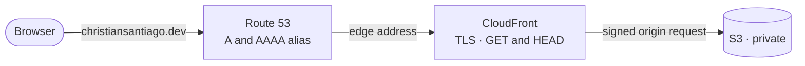
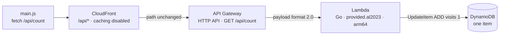

# Architecture

Two paths run through this repository: a browser loading a static page, and that same page asking for
a number. The first touches no compute at all. The second is one Lambda invocation and one DynamoDB
write, and everything interesting here is about keeping those two paths from complicating each other.

Files worth reading first: [`counter/internal/visits/visits.go`](../counter/internal/visits/visits.go)
for the write, [`counter/cmd/counter/main.go`](../counter/cmd/counter/main.go) for the handler around
it, and [`infra/cloudfront.tf`](../infra/cloudfront.tf) for the routing that makes them one origin.

## The two request paths

A page load never reaches compute. CloudFront serves it from the edge, and on a miss fetches from a
bucket no one else can read:



The counter path starts in the page that load returned, and stays on the same origin the whole way:



The number the browser renders comes back along that same chain. Nothing reads the table on the way
out, for the reason in the next section.

## The count comes back from the write

The counter is a single `UpdateItem` carrying `ADD visits :one`, with `ReturnValues` set to
`UPDATED_NEW`. Two properties fall out of that one call.

It is atomic. `UpdateItem` sends an instruction rather than a value, and DynamoDB evaluates the
instruction under a lock on the item, so concurrent callers queue instead of interleaving. The read
modify write version of the same feature drops counts, because two requests can read the same value
before either writes, and it drops them silently: nothing errors and the number still goes up.
`TestReadModifyWriteLosesVisits` builds exactly that version against the same fake and records 2 of
500 concurrent visits. `TestAtomicAddKeepsEveryVisit` records 500 of 500.

It costs one call rather than two. `UPDATED_NEW` returns the attributes the update touched, so the
new count arrives with the acknowledgement and the handler never issues a read. That is visible in
the IAM policy, which grants `dynamodb:UpdateItem` and deliberately not `GetItem`.

DynamoDB puts numbers on the wire as decimal strings, to preserve a precision no language's numeric
type covers uniformly, so the count arrives needing a `strconv.ParseInt` rather than as a number.

## The interface is declared where it is consumed

`visits.Updater` names one method, `UpdateItem`, with the SDK's exact signature. It lives in the
package that calls it rather than in the package that implements it, which is the Go idiom and the
reason it works: interfaces are satisfied structurally, so `*dynamodb.Client` satisfies `Updater`
without knowing the interface exists, and a fake in the test file satisfies it just as well.

```go
type Updater interface {
	UpdateItem(ctx context.Context, params *dynamodb.UpdateItemInput, optFns ...func(*dynamodb.Options)) (*dynamodb.UpdateItemOutput, error)
}

// Fails to compile if the SDK client ever stops satisfying Updater.
var _ Updater = (*dynamodb.Client)(nil)
```

That assertion line is the guard. Without it, an SDK change to the method signature would surface as
a runtime failure in the deployed function rather than as a build failure in CI.

The handler layer repeats the pattern one level up: `main.go` declares an `incrementer` interface with
the single method it needs from the counter, so the handler tests exercise the response shaping and
the error path with no AWS client anywhere in the process.

## Failures are responses, not Go errors

Returning a non nil `error` from a Lambda handler surrenders the status code and the body to API
Gateway, which answers `502` with no body of its own. Every failure path here therefore returns a
response and a nil error.

The detail goes to the log and not to the caller. DynamoDB errors carry table names and the endpoint
is public, so the caller gets `{"error":"could not record visit"}` and CloudWatch gets the
`slog` line with the cause. `TestHandlerDoesNotLeakInternalErrors` asserts that separation, so the
next person to add a failure path cannot casually widen it.

The handler wraps its own work in a three second context, well under the function's ten second
timeout. A stalled DynamoDB call becomes a `500` the caller can see, rather than Lambda cutting the
invocation off with no response at all.

## The counter is same origin, so CORS does not exist here

The browser asks for `/api/count` on the site's own domain. CloudFront routes it with an ordered
cache behaviour on `/api/*` that sits in front of the default behaviour, so static objects still go
to the bucket and only the API prefix reaches API Gateway. The route key in API Gateway is
`GET /api/count`, prefix included, because CloudFront forwards the path unchanged.

Two managed policies carry that behaviour, and both are load bearing:

- **`Managed-CachingDisabled`.** Under the site's caching policy the edge would hold the first
  response and serve one frozen number to every visitor while DynamoDB incremented correctly behind
  it. The bug would look like a broken counter and be a caching decision.
- **`Managed-AllViewerExceptHostHeader`.** `execute-api` routes on `Host` and recognises only its own
  name, so forwarding the site's domain gets the request rejected as an unknown host.

The alternative was a second origin with a CORS allowlist. Choosing same origin means there is no
preflight, no `Access-Control-Allow-Origin` to keep in step with the domain, and no second
certificate. It costs a hop, measured at roughly 80 ms at p50 from one location, because a behaviour
with caching disabled can never save a round trip. See [OPERATIONS.md](OPERATIONS.md#performance).

## The page is complete before the counter answers

`client/main.js` is progressive enhancement throughout. The markup ships with an em dash in
`#visitor-count`, and the fetch replaces it. A rejected fetch is logged and otherwise left alone, so
a dead counter degrades to the em dash rather than to a broken page.

That is also what makes the end to end test meaningful. The count exists only after JavaScript has
run, so neither the Go unit tests nor a `curl` against the API can see the em dash left in place.
The Playwright assertion is the only check in the repository that can.

## What this shape rules out

The table holds one item keyed on the literal string `site`, so every write lands on one partition
and the ceiling is roughly 1,000 writes per second. Sharding the key across `site#0` to `site#9`
would lift it, and would cost a ten item fan out on every read, forever, for headroom a personal site
will never reach.

The counter counts requests to `/api/count`, which is not the same thing as counting humans. Bots
that run JavaScript are counted, the end to end test counts itself on every deploy, and a visitor who
reloads is counted again.

Deduplicating them is a privacy decision before it is a technical one. Every mechanism that
recognises a returning visitor stores something that identifies them, whether that is a cookie, a
device fingerprint, or a hashed IP address, and all three are personal data under GDPR and the CPRA.
Doing it properly means a lawful basis for processing, a consent banner on a site that sets no
cookies today, a retention period, and a path for a deletion request. The stored state here is one
integer with nothing attached to it, and that is the version of this feature that stays honest
without a privacy policy behind it.
