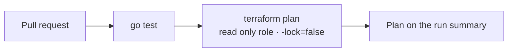
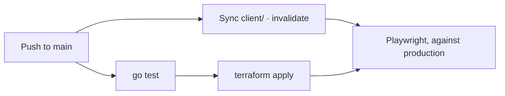

# Deploying christiansantiago.dev to AWS

Everything in this repository is provisioned by the Terraform in [`infra/`](../infra), applied by
GitHub Actions over OIDC. There are no console created resources, no long lived AWS keys, and one
state file covering both the site and the counter.

Home region is `us-east-2`. Route 53, CloudFront, IAM, and Budgets are global. The ACM certificate is
the exception that a second provider block exists for.

## What gets provisioned

One state file, five groups.

| Group | Resources |
|---|---|
| Delivery | S3 bucket, public access block, bucket policy, CloudFront distribution, Origin Access Control |
| Names and TLS | ACM certificate in `us-east-1`, its validation records and the validation wait, A and AAAA alias records for the apex and `www` |
| Counter | DynamoDB table, Lambda function and its execution role and inline policy, CloudWatch log group, HTTP API, integration, route, `$default` stage, invoke permission |
| Guardrails | SNS topic and email subscription, three CloudWatch alarms, an account wide AWS Budget |
| CI identity | Deploy, plan, and apply roles with their trust and permission policies |

Two things are read rather than created, and both are deliberate:

- **The Route 53 hosted zone.** The registrar created it at registration and the `.dev` registry
  delegates to its nameservers. Declaring it as a resource creates a *second* zone with different
  nameservers: Terraform reports success, records land in the new zone, the registry still points at
  the old one, and the site resolves to nothing. Importing it would work and would put the live
  delegation inside `destroy`'s blast radius, so this configuration reads it with a data source.
- **The GitHub OIDC provider.** IAM allows one provider per issuer URL per account, and the sibling
  portfolio repositories authenticate through the same one. Owning it here would mean a
  `terraform destroy` in this project silently breaking their pipelines.

The Terraform state bucket is also outside this configuration, for the ordinary reason: a backend
cannot be created by the configuration that stores its state in it.

### The certificate lives in us-east-1

CloudFront is global and looks for its certificate in exactly one region. A certificate issued
anywhere else is invisible to the distribution, and the error does not mention the region. The home
region here is `us-east-2` on purpose: picking `us-east-1` for everything would have hidden the
constraint behind a coincidence.

```hcl
provider "aws" {
  alias  = "us-east-1"
  region = "us-east-1"
}
```

One resource uses that alias, plus the validation wait beside it. The validation *records* do not:
Route 53 is global, and where the certificate lives has no bearing on where the proof is published.

## Prerequisites

1. An AWS account, and a domain registered in Route 53 in that account, so the hosted zone the
   configuration reads already exists.
2. An S3 bucket for state, and `infra/versions.tf` pointing at it. The backend uses `use_lockfile`,
   which needs Terraform 1.10 or newer and no DynamoDB lock table.
3. A GitHub OIDC provider in the account, for `https://token.actions.githubusercontent.com`. Create
   it once if nothing else in the account has.
4. The values in [`infra/variables.tf`](../infra/variables.tf) changed to your own: the domain, the
   GitHub owner and repository, both numeric IDs, and the alert email.

The numeric IDs come from the API rather than from the URL:

```bash
gh api repos/OWNER/REPO --jq '{owner: .owner.id, repo: .id}'
```

They exist because repositories created after 2026-07-15 use immutable subject claims, which embed
those IDs so a trust policy survives a rename and cannot be inherited by whoever claims the old name.

## Step 1: Apply from your workstation

The first apply has to come from a human, because the roles CI assumes are created by it.

```bash
git clone https://github.com/Go-Santiago-Go/christiansantiago.dev.git
cd christiansantiago.dev

terraform -chdir=infra init
make plan     # builds the Lambda binary, then plans
make apply
```

Expect 10 to 25 minutes. Certificate validation waits on DNS propagation, and the CloudFront
distribution took 9m46s on its own on the first run here, which was roughly nine tenths of the wall
clock. The counter resources are quick by comparison: all ten came up in under a minute.

Nothing is in the bucket yet, so the site returns an error until the first deploy publishes it.

## Step 2: Confirm the alert subscription

Terraform creates the SNS email subscription and reports success, and it delivers nothing until the
link AWS sends is clicked. Do that now, or the alarms in [OPERATIONS.md](OPERATIONS.md#alarms) are
decoration.

## Step 3: Wire the workflows

Three role ARNs go into the repository, under **Settings → Secrets and variables → Actions →
Variables**. They are variables rather than secrets: an ARN is an identifier and grants nothing on
its own, and keeping them outside the code makes pointing the deploy at another account a settings
change rather than a commit.

```bash
terraform -chdir=infra output ci_role_arns
```

| Variable | Role | Used by |
|---|---|---|
| `AWS_ROLE_ARN` | `christiansantiago-dev-deploy` | `deploy-site.yml` |
| `AWS_PLAN_ROLE_ARN` | `christiansantiago-dev-plan` | `infra.yml`, on pull requests |
| `AWS_APPLY_ROLE_ARN` | `christiansantiago-dev-apply` | `infra.yml`, on `main` |

One value is still hardcoded: the CloudFront distribution ID in the invalidation step of
`deploy-site.yml`. A fresh deploy to a new account has to change it. It should come from a Terraform
output the way the role ARNs do, and it is on the list in the README's *What I'd do differently*.

## Step 4: Push

From here, `git push` is the deploy.





Paths decide which half runs. A commit touching only `client/**` publishes the site and does not
apply Terraform; a commit touching `infra/**` or `counter/**` applies and does not republish the
site. Both end in the same end to end job, because a deploy that fails the smoke test is a failed
deploy.

The pull request trigger is deliberately unfiltered, so the plan reports on every pull request and
can be made a required check. A path filtered one would stay pending forever on the pull requests it
skipped, and block the merge.

## The trust model

Three roles rather than one, because they answer to different trust.

| Role | Trusted subject | Permissions |
|---|---|---|
| deploy | `...:ref:refs/heads/main` | `s3:ListBucket` on the bucket, `PutObject` and `DeleteObject` on its contents, `cloudfront:CreateInvalidation` on the distribution. No `GetObject`: it can publish the site and cannot read it back. |
| plan | `...:pull_request` | AWS managed `ReadOnlyAccess`, nothing else. |
| apply | `...:ref:refs/heads/main` | Eleven services this stack uses, plus IAM confined to the `christiansantiago-dev-*` name prefix and a `PassRole` scoped to the counter's execution role. |

Three details in that table are the whole security argument:

**The subject claim is pinned to a branch, not just a repository.** Matching on the repository alone
would let anything able to push a branch deploy to production. Omitting the subject condition
entirely would let any workflow in any public repository on GitHub assume the role.

**The plan role's condition is `StringEquals`, not `StringLike`.** A wildcard over the last segment
would also match `ref:refs/heads/main` and hand every pull request the apply role's reach. Fork pull
requests cannot reach it at all, because GitHub refuses them the `id-token: write` permission, so
they never obtain a token to trade.

**The plan job runs with `-lock=false`.** A plan takes a state lock by default, which would need
write access to the lock object to buy nothing, since nothing a plan does can corrupt state. Dropping
the lock is what lets the role stay genuinely read only.

The apply role is the one place this is not least privilege, and the code says so: it can create IAM
roles, and creating IAM roles is a path to admin. The name prefix narrows that reach without closing
it. The real control is the trust policy, which admits exactly one ref.

## Teardown

```bash
make destroy
```

The counter, the alarms, the budget, and the CI roles come out cleanly. Two things do not, and both
are by design:

- **The hosted zone survives**, because it is a data source. That is the point: the domain's
  delegation is not inside this configuration's blast radius.
- **The OIDC provider survives**, for the same reason. The sibling repositories still authenticate
  through it.

The bucket must be empty before it will delete, so a destroy after a deploy needs
`aws s3 rm s3://christiansantiago-dev-site --recursive` first.

At rest this stack is roughly fifty cents a month, which is the hosted zone, so tearing it down
between sessions is not the cost control it is on the sibling repositories. See
[OPERATIONS.md](OPERATIONS.md#cost).

## Troubleshooting

**The apply hangs on `aws_acm_certificate_validation`.** It is waiting for ACM to see the validation
CNAMEs. If it never resolves, check that the zone the records landed in is the zone the registry
delegates to. A second hosted zone for the same domain is the classic cause, and the symptom points
at CloudFront rather than at DNS bookkeeping.

**CloudFront refuses to create the distribution over an alias.** Every name in `aliases` must also
appear on the certificate. Adding a name means adding the SAN first.

**Origin fetches return 403 for everything.** Either the bucket policy is missing its
`AWS:SourceArn` condition target, or the Origin Access Control `signing_behavior` is not `always`.
The `no-override` setting signs only when the viewer request already carried an `Authorization`
header, which for anonymous visitors means never.

**The site serves a stale page after a deploy.** The invalidation returns as soon as CloudFront
accepts it, not once the edges have caught up. The Playwright suite retries twice in CI for exactly
this reason.

**CI cannot assume its role.** STS denies without explaining why. Compare the subject in the trust
policy against the one in the run: the plain `repo:owner/name` form never matches a repository using
immutable claims, and a job missing `id-token: write` fails complaining about credentials rather than
about permissions.

**`terraform plan` fails on the archive data source.** The Lambda binary does not exist. Run
`make counter`, or use `make plan`, which does it first.
